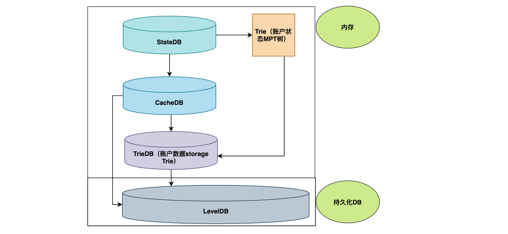

# KDB(KanBanData)
自主可控链数据库事务管理

数据库接口 KBD/kdb
使用了github.com/syndtr/goleveldb/leveldb的leveldb封装

github.com/MonteCarloClub/KBD/state



# 4月进度
## 上旬：将底层的DB和trie层的BD整合成stateDB

New()
新建世界状态数据库


GetOrNewStateObject()
获取单个账户对象


UpdateStateObject()
更新账户对象

### 一万次随机地址读写
``` shell
➜  KBD git:(main) ✗ go test -run TestDB github.com/MonteCarloClub/KBD/state
```
测试结果:
``` shell
ok      github.com/MonteCarloClub/KBD/state     1.343s [no tests to run]
```
### 一万次随机地址并发读写
``` shell
➜  KBD git:(main) ✗ go test -run TestDB_goroutine github.com/MonteCarloClub/KBD/state
``` 
测试结果:
``` shell
ok      github.com/MonteCarloClub/KBD/state     0.440s [no tests to run]
```
### 一万次随机地址读写(内存数据库)
``` shell
➜  KBD git:(main) ✗ go test -run TestMemDB_goroutine github.com/MonteCarloClub/KBD/state
``` 
测试结果:
``` shell
ok      github.com/MonteCarloClub/KBD/state     1.072s [no tests to run]
```
### 一万次随机地址并发读写（内存数据库）
``` shell
➜  KBD git:(main) ✗ go test -run TestMemDB github.com/MonteCarloClub/KBD/state
```
测试结果:
``` shell
ok      github.com/MonteCarloClub/KBD/state     0.560s [no tests to run]
```
|     | 持久化    | 内存     |
|-----|--------|--------|
| 不并发 | 1.343s | 1.072s |
| 并发  | 0.440s | 0.560s |

## 下旬:准备开始kbpool

---


# 5月进度

## 上旬:完成kbpool的基础架构

## 下旬:从以太坊中迁移pow、vm、filter、even、以及区块结构部分，使代码先跑起来

## 后续:
### 1：将Kchain的相关机制替换到上述从以太坊迁移的代码
### 2：修改Kbpool的验证流程完成实现分片相关机制